# EzFIX - Hostel Damage Reporting System

EzFIX is a web-based platform designed for KTDI residents and admins to efficiently manage and resolve hostel-related damage reports. The system allows residents to report issues, track progress, and view their profiles while providing admins a dashboard to manage and edit reports, upload announcements, and more.

## WebApp link: [https://theezzfix.onrender.com](https://theezzfix.onrender.com)

## Technologies Used

- **Frontend**: React with Tailwind
- **Backend**: Java Spring Boot
- **Database**: MongoDB Atlas
- **Deployment**: Render

## Features

### User Features:

- **Sign In**: Secure login for residents to access the platform.
  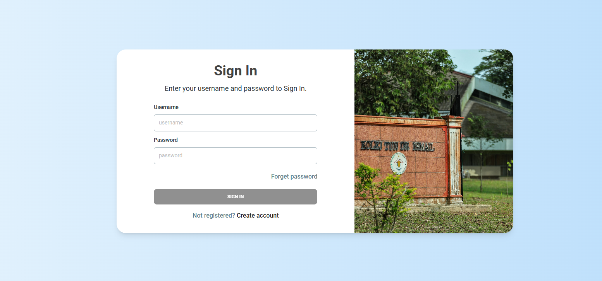

- **Sign Up**: Allows new users to create an account and join the system.
  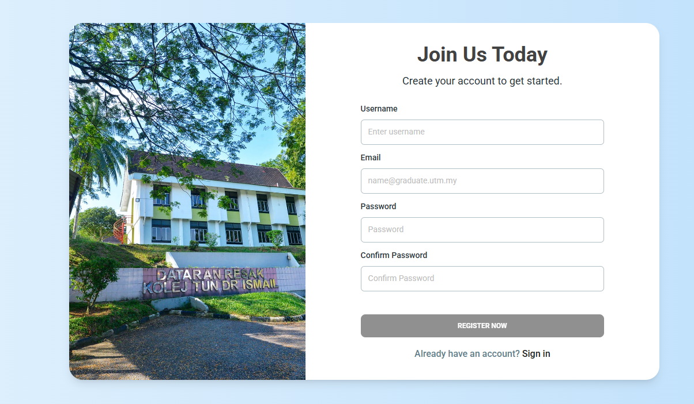

- **User Dashboard**: A personalized dashboard where residents can view their reports and account details.
  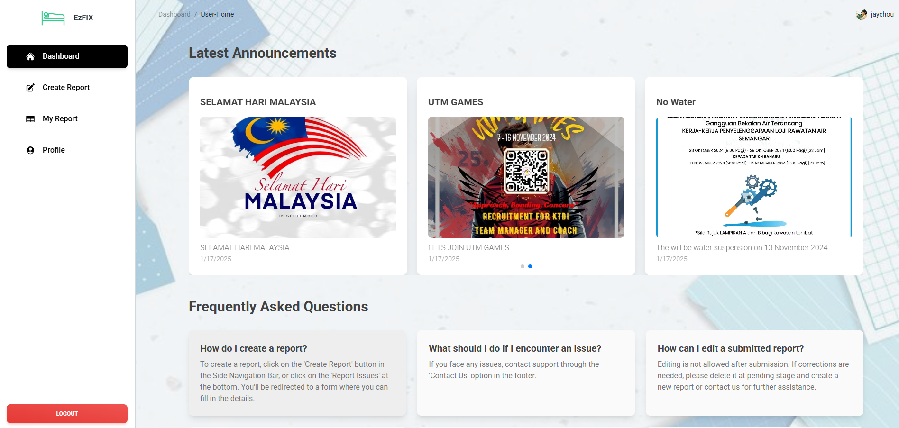

- **User Add Report**: Residents can create and submit damage or maintenance reports with relevant details.
  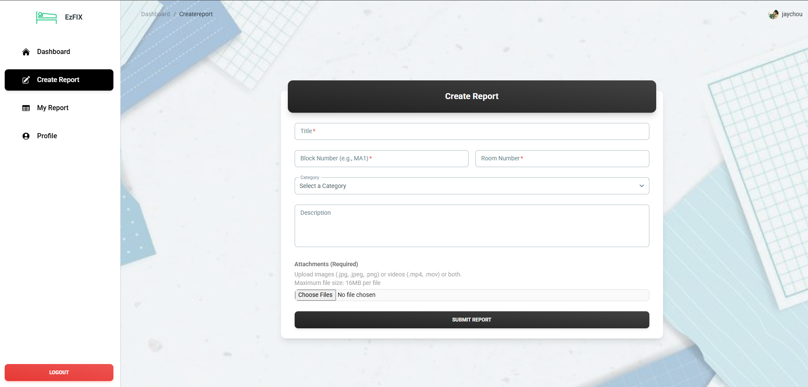

- **User View Report**: Residents can view a list of all their submitted reports.
  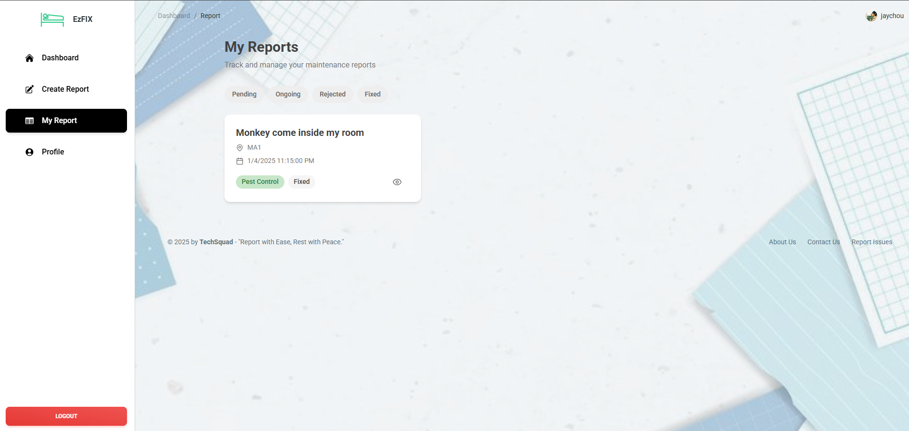

- **User View Report Detail**: Detailed view of a specific report with all relevant information.
  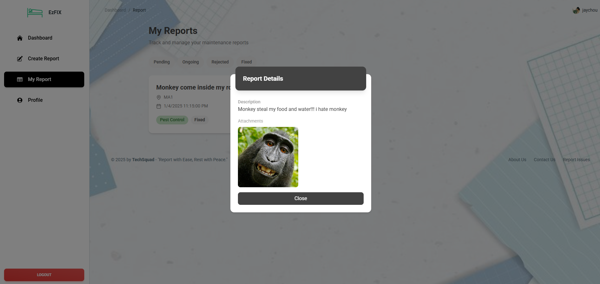

- **User Profile**: Residents can manage and update their personal information.
  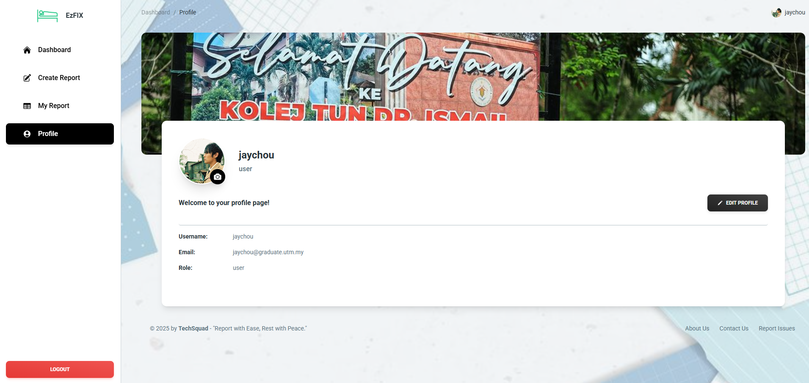

### Admin Features:

- **Admin Dashboard**: Admins have a comprehensive dashboard to manage users and reports.
  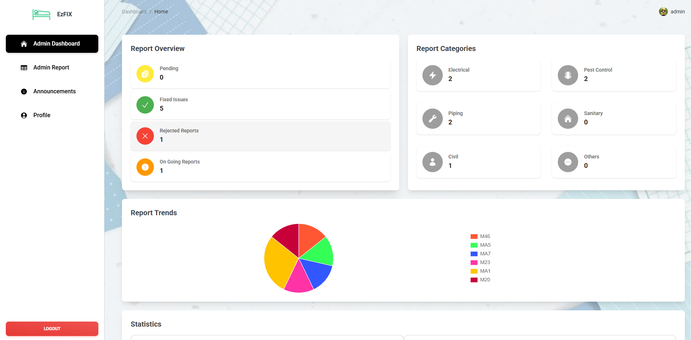

- **Admin View Report**: Admins can view all reports submitted by residents.
  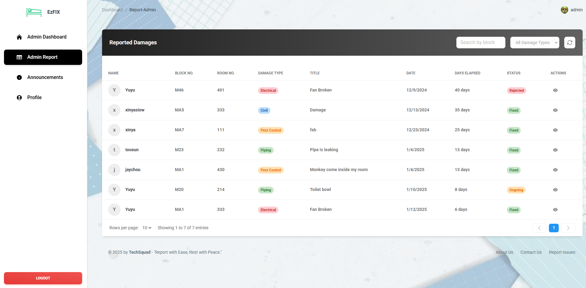

- **Admin Edit Report**: Admins can edit and update reports as necessary.
  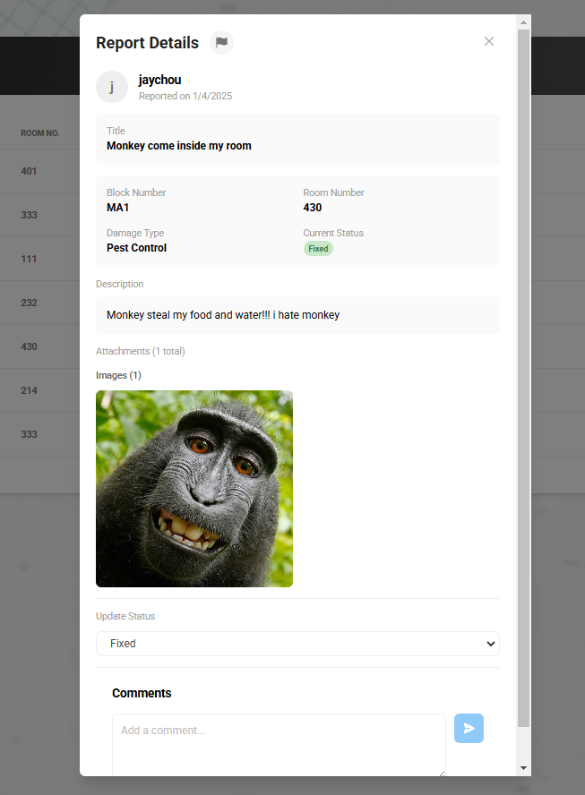

- **Admin Upload Announcement**: Admins can upload and display important announcements to all residents.
  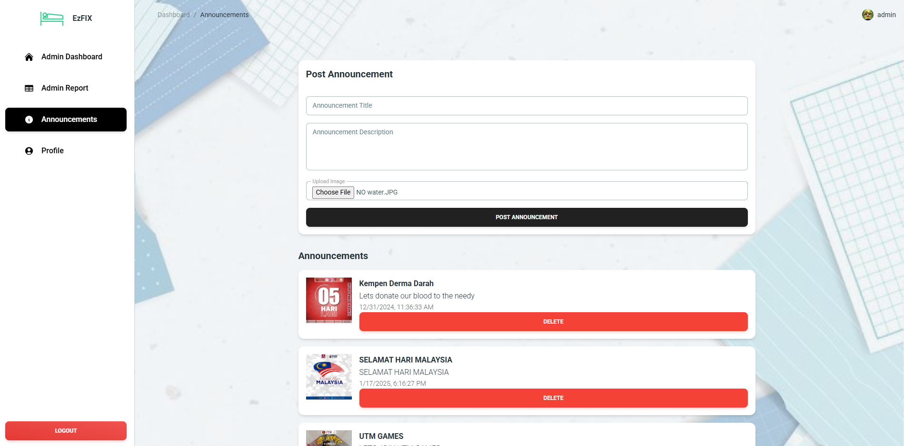

